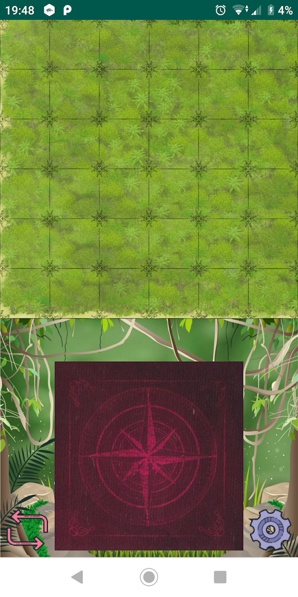
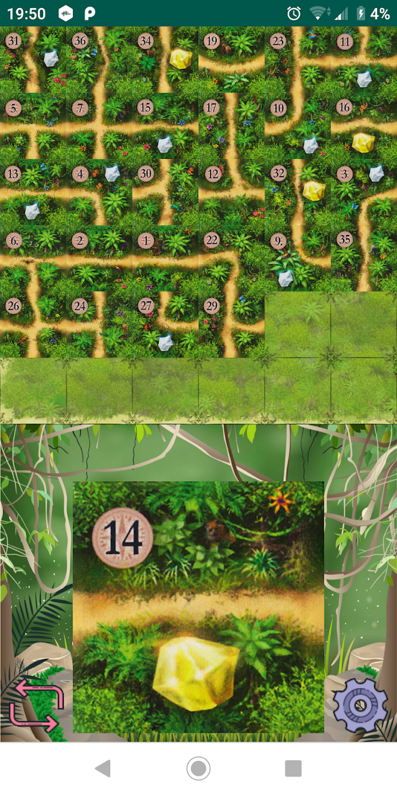

# Karuba Tile Selector
This is a helper app for the [Karuba](https://www.habausa.com/karuba-tile-laying-puzzle-game/) board game.

It was made as part of my Android development learning path and demonstrates the basic use of Animation in Android apps, as well as text to speech and backgrooud music.

You can download the app from [Google Play](https://play.google.com/store/apps/details?id=il.co.woo.karuba&hl=en) to understand how it works or use the code freely to learn how to animate your own app.

 

